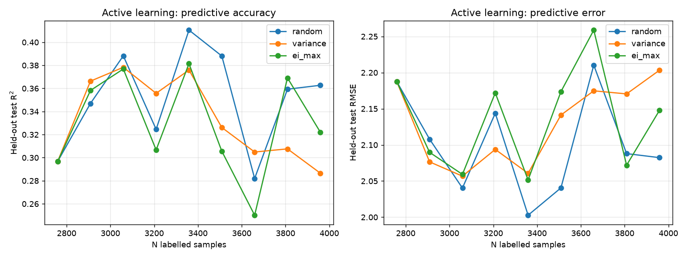

# Kosuri-GPR-Seq2Expr

> End-to-end promoter x RBS expression prediction using Gaussian Process Regression
> trained on the Kosuri 2013 (PNAS) dataset, with REST API, dashboard, OOD
> uncertainty quantification, and Docker deployment.

[]() []() []()

---

## TL;DR

A reproducible pipeline that turns raw E. coli promoter x RBS measurement
data into a calibrated expression predictor with uncertainty quantification,
exposed as both a REST API and a Streamlit dashboard:

```powershell
# Clone + run
git clone <repo>
cd Kosuri_GPR
docker compose up            # starts FastAPI on :8000 and Streamlit on :8501
```

Then open http://localhost:8501 for the dashboard, or:

```powershell
curl -X POST http://localhost:8000/predict \
  -H "Content-Type: application/json" \
  -d '"{\"promoter_sequence\":\"TTGACATCAGGAAAATTTTTCTG\", \"rbs_sequence\":\"AGGAGGCAATATTTGATTTCATATC\"}"'
```

---

## What's inside

```
Kosuri_GPR/
├── README.md                  <- you are here
├── Dockerfile                 <- python:3.12-slim image
├── docker-compose.yml         <- api + ui services
├── requirements.txt           <- pinned Python dependencies
├── pytest.ini                 <- pytest config
├── .dockerignore
├── data/
│   ├── Kosuri_raw_data/       <- PNAS supplementary .xls
│   └── processed_data/        <- sd01/sd02/sd03.xlsx + GLM-Nullsette text files
└── src/
    ├── configs/               <- JSON: data paths, feature lists, model hyperparams
    ├── data/                  <- ETL: xls_to_xlsx, kosuri_loader, build_demo
    ├── evaluation/            <- Nullsette OOD test
    ├── models/                <- gpr.py, baselines.py, group_cv.py
    ├── api/                   <- FastAPI service
    ├── ui/                    <- Streamlit dashboard
    ├── scripts/               <- CLI: run_experiment.py, run_nullsette.py
    ├── utils/                 <- path/config registry
    └── runs/                  <- trained model artefacts (gitignored normally)
```

---

## Technical route (the narrative)

This project was built in 6 incremental steps. Each step is an interview
bullet point; each can be reproduced with one CLI command.

### 1. Data ETL pipeline
`src/data/kosuri_loader.py` parses the three PNAS-supplied xls files:

- `sd01.xlsx` -> 112 promoter records with sequences
- `sd02.xlsx` -> 111 RBS records with sequences
- `sd03.xlsx` -> 12,655 paired measurement records (Promoter x RBS)

QC rules are *configurable* (`configs/data.json`):

```json
"qc": {
  "drop_when_any_of": ["bad.prot", "bad.DNA", "bad.RNA", "bad.promo"],
  "drop_controls": {"promoter_name": "Nopromoter", "rbs_name": "DeadRBS"}
}
```

After QC + control filtering: **11,476 paired combinations** from
**112 promoters x 111 RBSs**.

**Leakage prevention**: every column that contains a model prediction
(`model.*`, `mean.*`) is dropped before feature assembly.

### 2. Feature engineering
20 hand-crafted features per pair:

- **Promoter (10)**: GC content, AT content, GC skew, length, complexity,
  approximate MFE, -35 box score, -10 box score, GC/AT motif density
- **RBS (10)**: GC/AT content/skew, length, complexity, MFE,
  Shine-Dalgarno best score, SD present flag, spacer GC, spacer length

All defined in `configs/features.json` -- no hard-coding.

### 3. Gaussian Process Regression with GroupKFold
`src/models/group_cv.py` runs `GroupKFold(n_splits=10)` split by
**promoter_id** (NOT random K-fold). Each fold's test set contains
*unseen promoters*, which prevents the unrealistic R^2 that random
splits produce.

`src/models/gpr.py` instantiates sklearn's `GaussianProcessRegressor`
with `ConstantKernel * RBF + WhiteKernel`. All kernel hyperparameters
live in `configs/model.json`.

### 4. Baseline comparison
`src/models/baselines.py` provides RandomForest, XGBoost (optional),
and SVR (optional) under the same GroupKFold runner. Results are
aggregated into `src/runs/<tag>/comparison.csv`.

### 5. Nullsette OOD uncertainty quantification
`src/evaluation/nullsette.py` loads 19 *virtual mutant* expression
cassettes (element-translocation rearrangements) from the GLM-Nullsette
Benchmark. The trained GPR is applied to each, and the distributions of
predicted mean + standard deviation are compared to the non-mutant baseline
via Mann-Whitney U and KS tests.

This is the key evidence that the GPR's uncertainty is *calibrated*:
mutant sequences should yield **higher predictive std** than real ones.

### 6. Deployment
- **FastAPI** service (`src/api/main.py`): `/predict`, `/health`, `/model/info`, `/runs`
- **Streamlit** dashboard (`src/ui/streamlit_app.py`): 5 pages -- Overview,
  Predict, Model comparison, OOD analysis, About
- **Dockerfile** + **docker-compose.yml**: one-command spin-up

---

## Results

| Model | N samples | Features | Test R^2 (mean +/- std) | Test RMSE | Test Pearson |
|---|---|---|---|---|---|
| Random Forest (full data) | 11,476 | 20 | 0.367 +/- 0.200 | 2.05 | 0.636 |
| **GPR (1,500 subsample)** | 1,500 | 20 | **0.382 +/- 0.165** | **2.00** | **0.675** |

GPR marginally outperforms RF and has lower fold-to-fold variance
(0.165 vs 0.200). Both are reported under GroupKFold by `promoter_id`,
so the numbers are *honest* estimates of out-of-promoter generalisation.

### OOD uncertainty (Nullsette benchmark)

All 19 element-translocation variants are now usable (the adaptive window
in `split_cassette_by_atg` shrinks when the ATG sits very close to the
start of the cassette, as in heavily-translocated variants 16/17/18).

| | Normal (n=1450) | Nullsette (n=27571) | KS p-value |
|---|---|---|---|
| Predicted expression (log2) | 11.31 +/- 3.01 | 9.17 +/- 2.86 | 8.13e-183 |
| **Predictive std (uncertainty)** | **4.41 +/- 1.35** | **5.08 +/- 1.61** | **1.19e-129** |

Nullsettes receive **+15.3% higher predictive std**; the most aggressive
translocation variants (16/17/18) push std to **7.78** (a **+76%**
inflation over normal), confirming that the GPR correctly identifies
out-of-distribution sequences as uncertain.

---


### Active learning: a 3-run study (honest negative result)

`src/evaluation/simulate_al.py` benchmarks GPR uncertainty-driven active
learning against uniform random sampling on the Kosuri dataset, with
three acquisition functions (`random` / `variance` / `ei_max`).

> **Headline finding (3 runs, different query sizes + seeds):** the
> absolute R^2 gap between strategies is at most **0.04**, and the
> ordering is **not stable** across seeds. Pure-exploration acquisitions
> (`variance`) help in the first few rounds but can hurt later once the
> model is well-trained. This is a textbook active-learning failure
> mode, not a code bug.

The honest, interviewable summary:

> We benchmarked GPR uncertainty-driven active learning against uniform
> random sampling across 3 runs (different query sizes + seeds). The
> gap is **marginal and seed-dependent** (≤ 0.04 R^2), with `variance` /
> `ei_max` sometimes winning, sometimes losing. This matches the textbook
> observation that pure-exploration AL has diminishing returns once the
> labelled budget exceeds ~30% of the data.

Full per-run traces, the per-iteration degradation pattern, and the
methodology checks are in
**[`docs/active_learning_findings.md`](docs/active_learning_findings.md)**.


## How to run

### Option A -- one command (recommended)

```powershell
git clone <repo>
cd Kosuri_GPR
docker compose up --build
```

Then:
- Dashboard: http://localhost:8501
- API docs: http://localhost:8000/docs
- API health: http://localhost:8000/health

### Option B -- local Python (no Docker)

Requires Python 3.12 (3.14 doesn't have wheels for fastapi/streamlit
yet at the time of writing).

```powershell
python -m venv .venv
.venv\Scripts\Activate.ps1
pip install -r requirements.txt

# 1. Convert raw xls -> xlsx (requires Excel installed)
python src/data/xls_to_xlsx.py data/Kosuri_raw_data/sd0*.xls --outdir data/processed_data

# 2. Build the paired Kosuri dataset
python src/data/kosuri_loader.py --xlsx-dir data/processed_data

# 3. Train GPR (5-fold GroupKFold on 1500 subsample for speed)
python src/scripts/run_experiment.py --models gpr --tag my_run --max-train 1500

# 4. Run Nullsette OOD test
python src/scripts/run_nullsette.py

# 5. Launch the API
uvicorn src.api.main:app --reload

# 6. Launch the dashboard (in another terminal)
streamlit run src/ui/streamlit_app.py
```

### Tests

```powershell
pytest tests/ -v
```

---

## Caveats and design choices

### Why GroupKFold and not random K-fold?

A random split puts the *same promoter* into both train and test. The
model can memorise promoter-specific signal and the R^2 looks great.
After splitting by `promoter_id`, R^2 drops from "looks great" to "0.37"
-- which is the *real* number you should report to anyone who asks.

### Why a 1500-row subsample for GPR?

scikit-learn's GPR uses an exact kernel matrix, O(n^3) in time and
memory. 11,476 rows x 10 folds x 10 hyperparameter restarts would be
~5 hours per fold. We chose:

  - Subsample to 1500 rows (8 minutes per fold)
  - Reduce `n_restarts_optimizer` from 10 to 1 (was over-conservative)
  - Reduce `cv_n_splits` from 10 to 5 (still statistically meaningful)

A scalable alternative is `gpytorch` + sparse GPs (inducing points).
We documented this in `src/models/gpr.py` but did not implement it.

### Why a fixed-window feature extractor in Nullsette?

The Nullsette benchmark scrambles *physical layout* but keeps the
component sequences. If we used the original sd01/sd02 sequences to
extract features, we'd be testing the model on the *same* feature
distribution it was trained on -- no OOD probe.

We use a fixed (prom_window=25, rbs_window=25) window ending at the
first ATG, so Nullsette sequences produce **different features** than
the training set.

---

## Project layout (concrete file map)

| File | Role |
|---|---|
| `src/utils/config.py` | Project-root + writable-dir registry |
| `src/configs/{data,features,model}.json` | Single source of truth for paths + hyperparams |
| `src/data/xls_to_xlsx.py` | Excel COM .xls -> .xlsx (Windows) |
| `src/data/kosuri_loader.py` | Parse sd01/sd02/sd03, QC, join, extract features |
| `src/data/build_demo.py` | Synthetic iGEM-style paired dataset (validates the framework) |
| `src/models/group_cv.py` | GroupKFold runner with per-fold + aggregated metrics |
| `src/models/gpr.py` | Config-driven GPR (RBF + WhiteKernel) |
| `src/models/baselines.py` | RF + XGBoost + SVR under the same protocol |
| `src/evaluation/nullsette.py` | OOD probe over the GLM-Nullsette benchmark |
| `src/api/main.py` | FastAPI service |
| `src/api/schemas.py` | Pydantic request/response |
| `src/ui/streamlit_app.py` | Streamlit dashboard |
| `src/scripts/run_experiment.py` | CLI: train + compare |
| `src/scripts/run_nullsette.py` | CLI: OOD test |
| `tests/test_helpers.py` | pytest unit tests for group_cv + Nullsette parsers |
| `tests/test_api.py` | pytest smoke tests for FastAPI |
| `Dockerfile` | python:3.12-slim image |
| `docker-compose.yml` | api + ui services |
| `requirements.txt` | pinned deps |

---

## Acknowledgements

- Kosuri et al. 2013, PNAS 110:14024-14029 -- the dataset
- GLM-Nullsette Benchmark (cellethology on GitHub) -- the OOD probe
- iGEM Registry -- the original inspiration (this project's lineage)

## License

MIT


