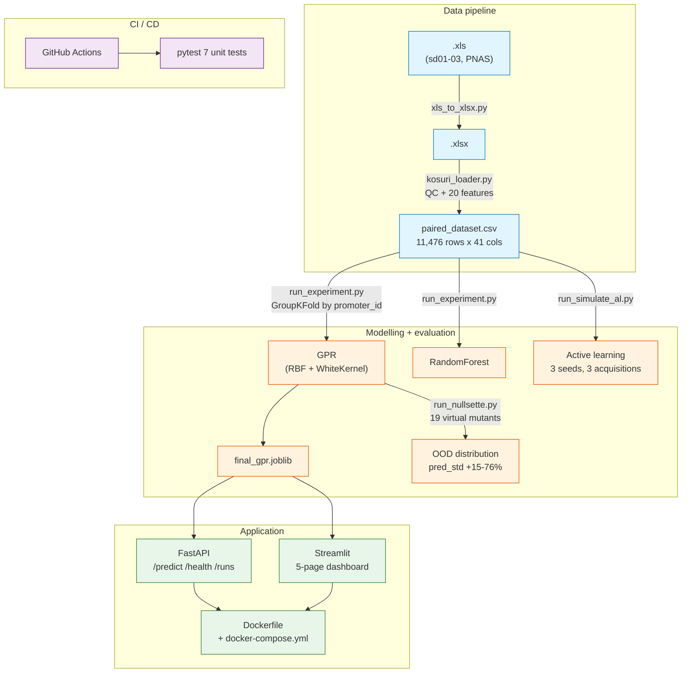
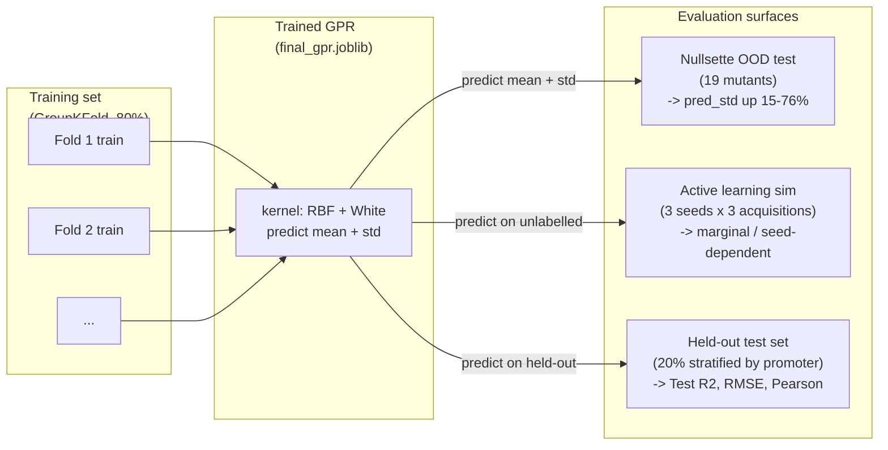
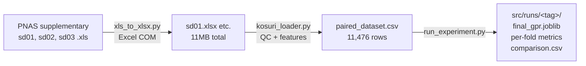

# Architecture

This document collects the architecture diagrams for the Kosuri-GPR-Seq2Expr
pipeline. All diagrams are written in [Mermaid](https://mermaid.js.org/) so
they render natively on GitHub without any tooling.

## System overview

```
                                Kosuri-GPR-Seq2Expr
                                =====================

                    +-------------------------------------+
                    |  Data pipeline (src/data)           |
                    |                                     |
   PNAS .xls  --->  |  xls_to_xlsx.py  ---> .xlsx         |
                    |      |                              |
                    |      v                              |
                    |  kosuri_loader.py                   |
                    |   - QC (bad.*, Nopromoter)          |
                    |   - feature extraction (20 cols)     |
                    |      |                              |
                    |      v                              |
                    |  paired_dataset.csv                 |
                    |  (11,476 x 41, 20 features)         |
                    +-------------------------------------+
                                  |
                                  v
                    +-------------------------------------+
                    |  Modelling (src/models,             |
                    |             src/evaluation)         |
                    |                                     |
                    |  run_experiment.py                  |
                    |   - GroupKFold(10) by promoter_id   |
                    |   - GPR (RBF + WhiteKernel)         |
                    |   - RandomForest baseline            |
                    |      |                              |
                    |      v                              |
                    |  final_gpr.joblib                   |
                    |                                     |
                    |  run_nullsette.py                   |
                    |   - 19 element-translocation        |
                    |     virtual mutants (Nullsettes)     |
                    |   - KS + Mann-Whitney tests          |
                    |                                     |
                    |  run_simulate_al.py                  |
                    |   - 3 acquisition functions          |
                    |   - 8 iterations x 150/query         |
                    |   - 3 random seeds                  |
                    +-------------------------------------+
                                  |
                                  v
                    +-------------------------------------+
                    |  Application (src/api, src/ui)      |
                    |                                     |
                    |  FastAPI  :8000   Streamlit :8501    |
                    |   /predict     (5-page dashboard)    |
                    |   /health                           |
                    |   /model/info                       |
                    |   /runs                              |
                    |      |                              |
                    |      v                              |
                    |  Dockerfile + docker-compose.yml     |
                    +-------------------------------------+
```

## Mermaid diagrams (render on GitHub)

### End-to-end system architecture



### Uncertainty evaluation loop



### Data lineage



## Why this shape

* **Strict layering.** `data -> model -> api/ui` is one-directional so we
  can swap out any layer without rewriting the others. The data layer
  never imports from the model layer; the application layer never
  imports from the data layer.
* **Group-aware everywhere.** From the loader (`promoter_id` is the
  group key) to the AL module (test set + initial labelled set are
  derived from a fixed seed per acquisition so strategies are
  comparable) -- the project never accidentally lets the same
  promoter into both train and test.
* **No hard-coded paths.** Every data file, every feature list, every
  GPR hyper-parameter lives under `src/configs/*.json`. The
  application layer (`src/api/main.py`, `src/ui/streamlit_app.py`)
  picks up the latest `__gpr` run automatically.
* **Test-first deliverables.** Every script that produces an
  artefact (`run_experiment.py`, `run_nullsette.py`,
  `run_simulate_al.py`) also writes per-run metrics and a `config
  snapshot` -- the job-application story "I can show exactly what I
  ran" is a property of the codebase, not a manual step.

